<p align="center">
  <picture>
    <source media="(prefers-color-scheme: dark)" srcset="docs/assets/branding/flowpde-logo-dark.png">
    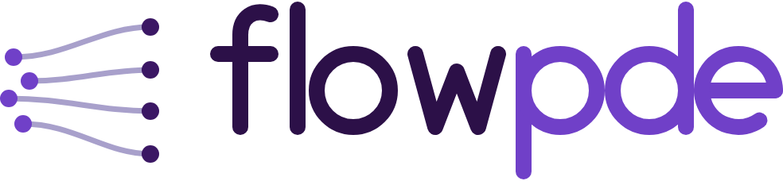
  </picture>
</p>

<p align="center">
  <strong>Flow-based generative models for forward and inverse PDE problems.</strong>
</p>

<p align="center">
  <a href="https://sarperyn.github.io/FlowPDE/">Documentation</a> &middot;
  <a href="https://sarperyn.github.io/FlowPDE/getting_started/installation/">Installation</a> &middot;
  <a href="https://sarperyn.github.io/FlowPDE/getting_started/quickstart/">Quickstart</a> &middot;
  <a href="https://sarperyn.github.io/FlowPDE/api/">API reference</a> &middot;
  <a href="report.pdf">Project report</a>
</p>

FlowPDE is a PyTorch library for learning conditional distributions between PDE
fields. It combines flow matching with neural ODEs to solve forward problems and inverse problems.

## What is included

- Poisson, Burgers, and Darcy dataset generation through
  [Exponax](https://fkoehler.site/exponax/)
- Forward and inverse datasets, including noisy and partial observations
- Flow matching and maximum-likelihood objectives over the same `NeuralODEFlow`
- MLP, ConvNet, ResNet, and UNet backbone neural network models
- ODE sampling, EMA training, evaluation in physical units, and reflow

Each of the six problem settings is drawn out under
[Problem settings](#problem-settings); the measured results are under
[Results](#results).

## Setup

FlowPDE requires **Python 3.11 or newer**. The `uv` path uses the versions recorded in
`uv.lock` and fetches a suitable interpreter itself; the pip path installs the runtime
dependencies from `requirements.txt` against any 3.11+ interpreter you already have.

With [uv](https://docs.astral.sh/uv/) (recommended):

```bash
git clone https://github.com/sarperyn/FlowPDE.git
cd FlowPDE
uv sync
source .venv/bin/activate
```

Without `uv`, use Python's built-in virtual environment and pip:

```bash
git clone https://github.com/sarperyn/FlowPDE.git
cd FlowPDE
python3 -m venv .venv               # any Python 3.11+
source .venv/bin/activate
python -m pip install --upgrade pip
python -m pip install -r requirements.txt
python -m pip install -e . --no-deps
```

For CUDA/JAX and the optional dependencies, see the
[installation guide](https://sarperyn.github.io/FlowPDE/getting_started/installation/).

## Quick Example

```python
import torch
from torch.utils.data import DataLoader

from flowpde import NeuralODEFlow, FlowMatchingObjective, Trainer, UNet
from flowpde.datasets import PoissonGenerator, FieldNormalizer

# Generate and normalize f -> u training pairs.
generator = PoissonGenerator(num_spatial_dims=2, num_points=64, domain_extent=10.0)
train_ds = generator.generate(num_samples=1000, seed=42, problem="forward")

normalizer = FieldNormalizer.from_dataset(train_ds)
train_ds.set_normalizer(normalizer)
loader = DataLoader(train_ds, batch_size=32, shuffle=True)

# The flow defines the dynamics; the objective defines how they are trained.
model = UNet(spatial_dim=2, spatial_size=64, base_channels=64)
flow = NeuralODEFlow(model, target_key="target", condition_key="input")
objective = FlowMatchingObjective(flow, path="linear", time_sampler="uniform")

optimizer = torch.optim.Adam(objective.parameters(), lr=1e-4)
trainer = Trainer(objective, optimizer, device="cpu", ema_decay=0.999)
trainer.train(loader, epochs=100, print_stats_interval=10,
              save_dir="results/poisson/", save_interval=25)

# Generate a solution conditioned on a PDE input.
batch = next(iter(loader))
samples = objective.sample(batch["input"], n_steps=50).view_as(batch["target"])
```

The full [quickstart](https://sarperyn.github.io/FlowPDE/getting_started/quickstart/) adds validation,
checkpointing, and evaluation in physical units.

## Notebooks

Six runnable notebooks in [`notebooks/`](notebooks/) pick up where the snippet above
stops:

- **Dataset exploration** — [`poisson_dataset.ipynb`](notebooks/poisson_dataset.ipynb),
  [`burgers_dataset.ipynb`](notebooks/burgers_dataset.ipynb),
  [`darcy_dataset.ipynb`](notebooks/darcy_dataset.ipynb): generate a dataset, report its
  field statistics, and plot samples — the quickest way to see what the flow is being
  asked to learn.
- **End to end** — [`poisson.ipynb`](notebooks/poisson.ipynb),
  [`burgers.ipynb`](notebooks/burgers.ipynb), [`darcy.ipynb`](notebooks/darcy.ipynb):
  generate data, build the flow, train it, and sample conditioned solutions.

The lockfile installs the kernel but not a Jupyter front-end, so either open the files
directly in an editor that renders notebooks, or bring one along for the run:

```bash
uv run --with jupyterlab jupyter lab notebooks/    # uv
pip install jupyterlab && jupyter lab notebooks/   # activated virtualenv
```

## Problem settings

Every PDE is available in both directions: `problem='forward'` and `problem='inverse'`
are arguments on the same generator, and all six settings are trained as the same
conditional flow. What changes between them is which fields are handed to the model as
conditioning and which field it has to generate.

Each figure below reads the same way. The left zone is the conditioning input $c$,
channel by channel. The right zone is the probability path the flow transports: a draw
from the base distribution at $t=0$, the interpolant at $t=0.5$, and the target at
$t=1$. What is learned is the velocity field $v_\theta(x, t \mid c)$ connecting them,
and sampling is one ODE solve. The footer of each figure is the generator call that
produced the fields shown.

### Poisson — $\nabla^2 u = f$

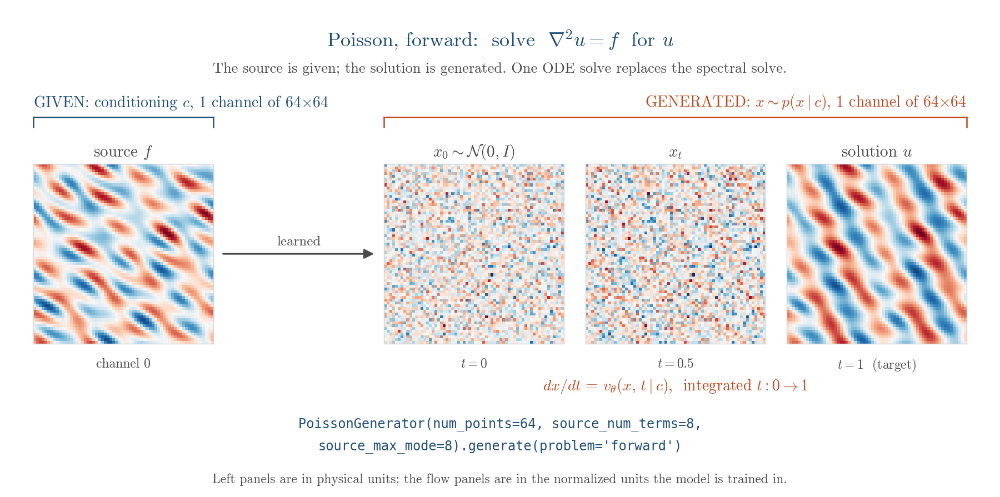

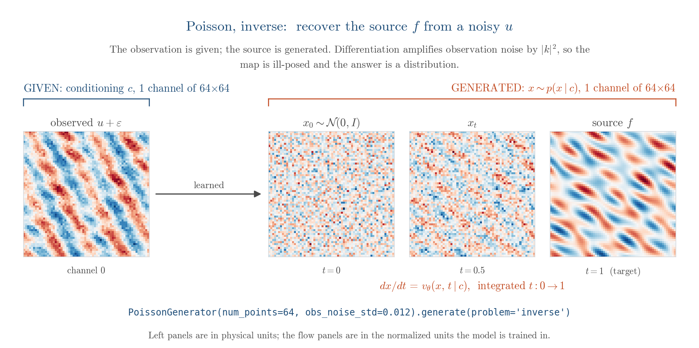

### Burgers — $\partial_t u + u \partial_x u = \nu \partial_x^2 u$

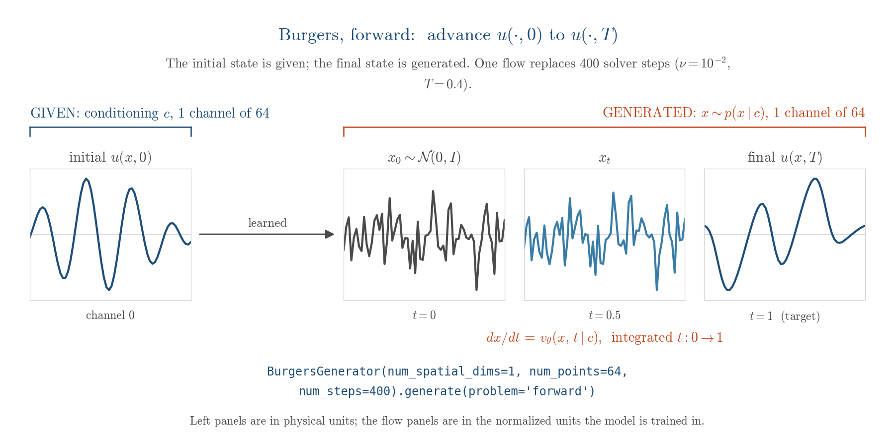

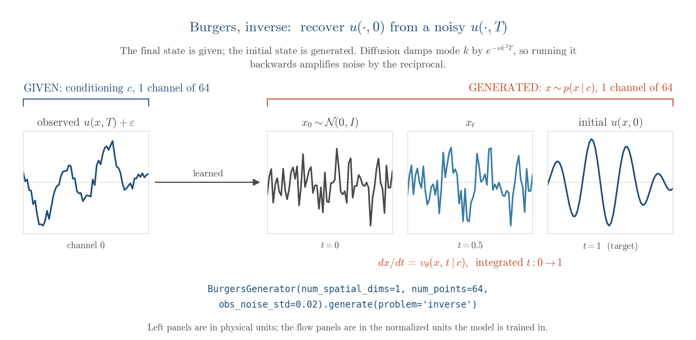

### Darcy — $-\nabla \cdot (\kappa \nabla u) = f$

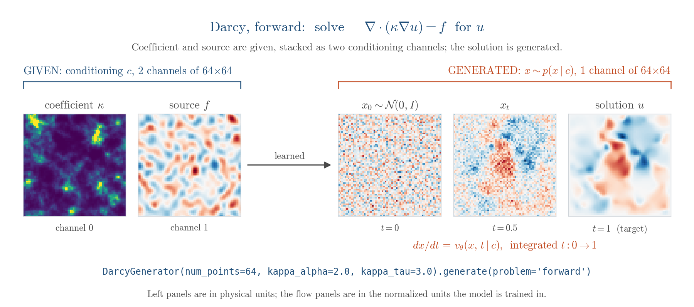

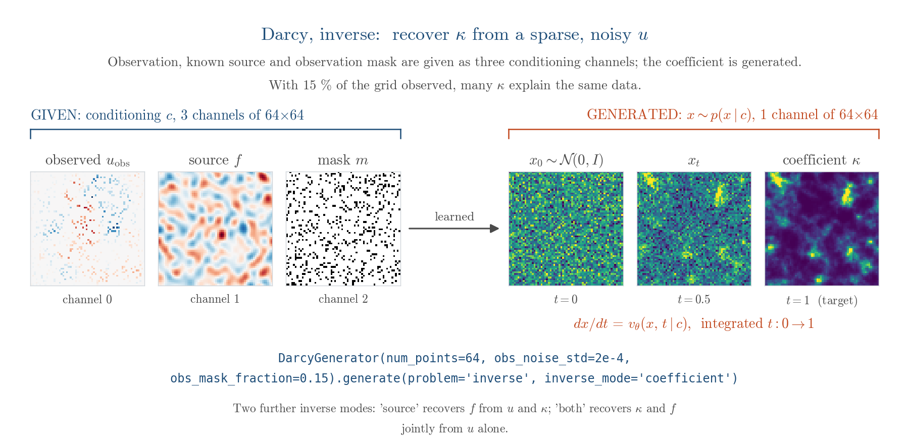

The Darcy inverse problem has three variants, selected with `inverse_mode`: recover the
coefficient $\kappa$ from $(u, f)$, recover the source $f$ from $(u, \kappa)$, or
recover both jointly from $u$ alone. Observations are degraded independently of the
direction — `obs_noise_std` adds Gaussian noise and `obs_mask_fraction` hides a random
fraction of the grid, appending the observation mask as an extra conditioning channel.


## Results

Every comparison below varies **one** axis with everything else held fixed — data,
splits, normalization, optimizer, schedule, averaging, sampler and evaluation seed —
so a difference between two numbers is attributable to the thing being varied. Errors
are relative $L^2$ in physical units on a held-out test split.

### Inverse problems: a posterior, not a point estimate

This is the case the library is really built for. Given a sparse, noisy observation of
the solution $u$, the model is asked to recover the Darcy coefficient $\kappa$ — a
problem whose answer is genuinely a distribution, not a field. Sampling the conditional
flow $K = 32$ times gives an ensemble whose spread concentrates where the data leave
$\kappa$ underdetermined.

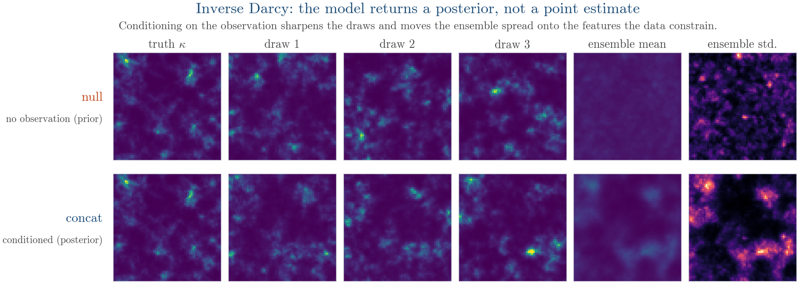

Scoring that ensemble as a distribution rather than scoring one draw as a point estimate
changes the conclusion. Proper scoring rules register roughly **twice** the effect of
conditioning that a single draw's relative $L^2$ does (18.6% against 12.8% on the
coefficient target, 25.4% against 13.8% on the joint one) — a metric comparing one
sample against one truth cannot distinguish a model that learned a broad posterior from
one that learned nothing. The same suite catches a failure a point metric rewards:
training the coefficient model five times longer improved its single-draw error by 15%
while moving its 90% coverage from 0.84 to 0.70.

Without ever being told that $\kappa$ is identifiable only where $\nabla u$ is large,
the learned posterior width falls by **3.9×** from the flattest to the steepest decile
of local flux.

### The sampler is an axis, not a detail

Solver and step count are call-time arguments on frozen weights, so the whole sweep runs
without retraining anything.

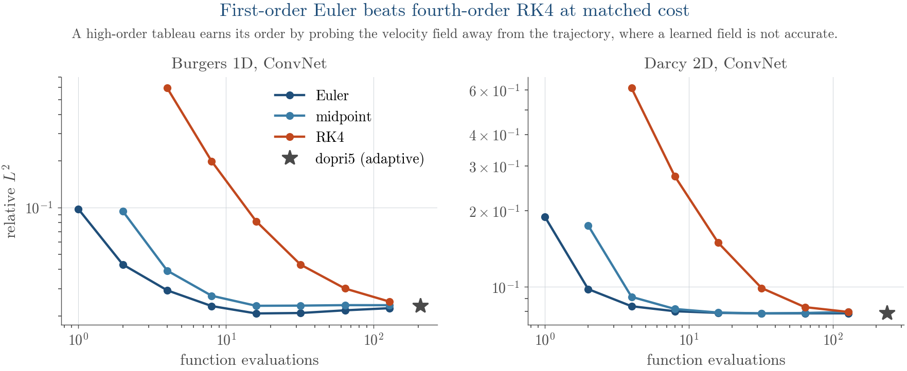

First-order Euler beats fourth-order Runge–Kutta at matched cost on every model and both
problems, by up to **8.6×**: a high-order tableau earns its order by probing the velocity
field away from the trajectory, and a learned field is not accurate there. Integrating to
convergence is also not the objective — on two of eight models the best fixed-step error
is 6–11% *below* the converged one, because truncation error partially cancels the
model's. An accuracy quoted "at 50 steps" is one point on a non-monotone, model-dependent
curve.

### Forward problems

The forward direction is reported as verification rather than as the case for the method.
Timed against the conjugate-gradient solver it replaces, the surrogate is 1.9× slower at
its cheapest setting and 65× at its most accurate; on a linear elliptic problem at this
size it does not pay for itself.

For 1D Burgers, the map from an initial state $u(x,0)$ to the evolved state $u(x,T)$
reaches a test relative $L^2$ of **0.022** with a ConvNet backbone.

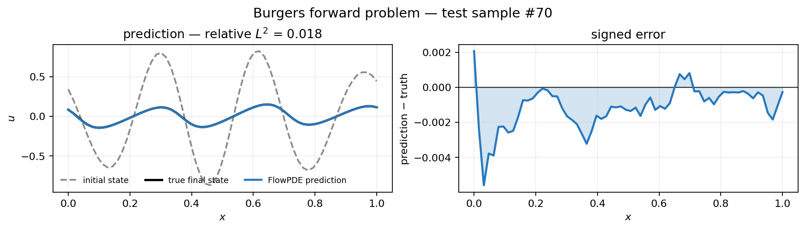

For 2D Poisson, mapping a source $f$ to its solution $u$ in the harder eight-mode source
regime reaches **0.077**. Widening the source spectrum alone raises the ConvNet's error
by **43%** — an operator-learning number is a joint statement about the method and the
distribution it was measured on, so the harder regime is the one quoted here.

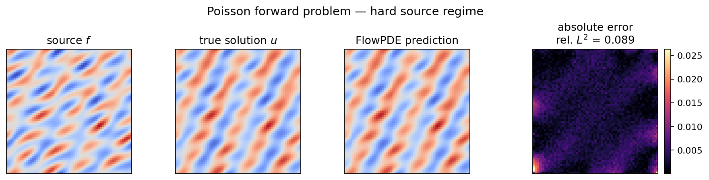

### What else the experiments found

- **Conditioning.** Replacing the conditioner with one that discards its input costs a
  factor of **17** in median relative $L^2$ while leaving the training loss curve looking
  healthy — the concrete case for selecting on sampled error, never on the loss.
- **Backbone.** The smallest of four backbones is the most accurate on both forward
  problems, by **12.4×** on Burgers, and attention changes nothing beyond seed noise.
  Capacity is not the binding constraint at this scale.
- **Objective.** Fitting the same flow by exact maximum likelihood rather than flow
  matching improves test likelihood from $-1.21$ to $-1.86$ nats/dim while degrading
  sample accuracy from 0.61 to 1.06 relative $L^2$, at **70×** the wall-clock and 8.9× the
  memory. Each objective wins on the metric it optimizes.
- **Amortization.** A preconditioned Crank–Nicolson reference chain had not mixed after
  52,000 forward solves per observation, costing 701 s per observation and producing
  nothing usable; the trained flow produced its 32-member ensemble in **16 s** and needed
  no forward solves at all.

Because the flow, objective, conditioner, backbone and solver are orthogonal components
rather than forks of a codebase, every comparison above was a configuration change, and
the sampler and ensemble results required no retraining at all.

Single-seed unless stated otherwise; five of the nine experiments are replicated at three
matched seeds. Full setup, ablations, and the negative results are in the
[project report](report.pdf) (24 pp.).


## Tests

The suite covers the flow, the objectives, the solvers, EMA, normalization, reflow,
straightness, and the UQ metrics, plus integration tests that generate real datasets
through Exponax. Those are marked `slow` because they run the PDE solvers.

```bash
uv sync --extra dev                 # installs pytest

uv run -m pytest                    # full suite
uv run -m pytest -m "not slow"      # skip the Exponax integration tests
uv run -m pytest tests/test_trainer.py -v
```

In an activated virtualenv, install the extra with `pip install -e ".[dev]"` and drop the
`uv run` prefix — `python -m pytest -m "not slow"`.

## Documentation

The documentation is hosted at **[sarperyn.github.io/FlowPDE](https://sarperyn.github.io/FlowPDE/)**.
It is built with MkDocs using the Material theme, and API pages are generated from the
docstrings by `mkdocstrings`, so they track the code rather than being written twice.
Every push to `main` rebuilds and redeploys it through
[`.github/workflows/docs.yml`](.github/workflows/docs.yml).

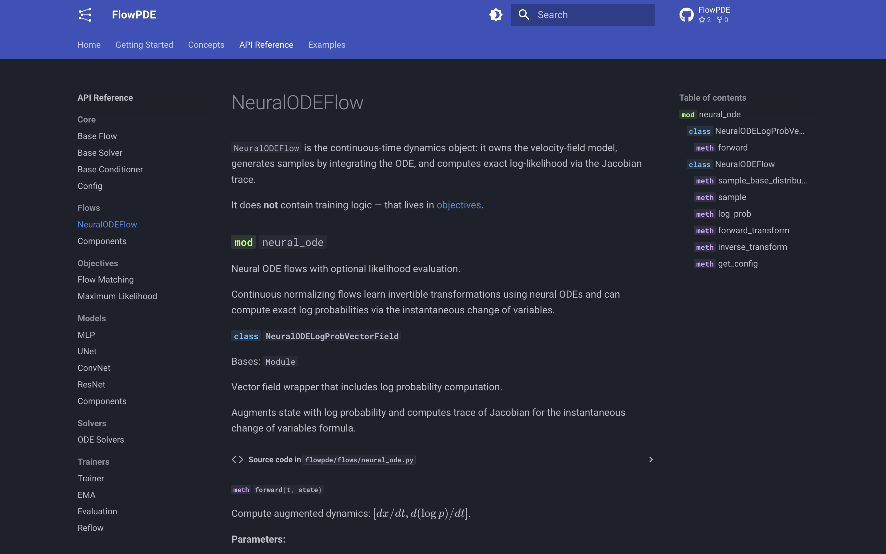

The source lives under `docs/`, organised as:

- **[Getting Started](https://sarperyn.github.io/FlowPDE/getting_started/installation/)** —
  installation, including the CUDA/JAX and optional dependencies, and a
  [quickstart](https://sarperyn.github.io/FlowPDE/getting_started/quickstart/) that extends
  the example above with validation, checkpointing, and evaluation in physical units.
- **Concepts** — an
  [architecture overview](https://sarperyn.github.io/FlowPDE/concepts/architecture/) of how
  flows, objectives, conditioners, backbones and solvers fit together, and a
  [flow-matching explainer](https://sarperyn.github.io/FlowPDE/concepts/flow_matching/).
- **[API Reference](https://sarperyn.github.io/FlowPDE/api/)** — every public class,
  generated from source.
- **[Examples](https://sarperyn.github.io/FlowPDE/examples/notebooks/)** — the notebooks
  under `notebooks/`, rendered.

To build it locally:

```bash
uv sync --extra docs                # mkdocs-material, mkdocstrings, mkdocs-jupyter

uv run mkdocs serve                 # live-reloading preview at http://127.0.0.1:8000
uv run mkdocs build --strict        # build into site/; --strict fails on bad links
```

`mkdocs serve` rebuilds on save, so editing anything under `docs/` — or any docstring an
API page pulls from — refreshes the open page. Use `--strict` before publishing: it turns
a broken cross-reference or a missing nav entry into an error instead of a warning.

## Credits

No third-party source is vendored into this repository — every module under `flowpde/`
was written for it, and the MIT licence below covers the whole tree. What the library
does borrow is *methods*: formulas, schedules and architectures taken from the
literature and implemented here from the papers.

### Methods implemented from the literature

| Component | Implements | Source |
| --- | --- | --- |
| [`flows/neural_ode.py`](flowpde/flows/neural_ode.py) | Continuous normalizing flow; instantaneous change of variables | Chen et al., *Neural Ordinary Differential Equations*, NeurIPS 2018 · Grathwohl et al., *FFJORD*, ICLR 2019 |
| [`flows/neural_ode.py`](flowpde/flows/neural_ode.py) | Stochastic trace estimator | Hutchinson, *A Stochastic Estimator of the Trace of the Influence Matrix*, Commun. Stat. 1989 |
| [`objectives/maximum_likelihood.py`](flowpde/objectives/maximum_likelihood.py) | Maximum-likelihood training of a CNF | Rezende & Mohamed, *Variational Inference with Normalizing Flows*, ICML 2015 · Grathwohl et al., ICLR 2019 |
| [`objectives/flow_matching.py`](flowpde/objectives/flow_matching.py), [`flows/components/paths.py`](flowpde/flows/components/paths.py) | Flow-matching objective; linear and OT-conditional paths | Lipman et al., *Flow Matching for Generative Modeling*, ICLR 2023 · Liu et al., *Rectified Flow*, ICLR 2023 · Tong et al., *Improving and Generalizing Flow-Based Generative Models with Minibatch Optimal Transport*, TMLR 2024 |
| [`flows/components/couplings.py`](flowpde/flows/components/couplings.py) | Mini-batch optimal-transport coupling | Tong et al., TMLR 2024 |
| [`flows/components/time_samplers.py`](flowpde/flows/components/time_samplers.py) | Logit-normal sampling of the flow time | Esser et al., *Scaling Rectified Flow Transformers*, ICML 2024 |
| [`trainers/reflow.py`](flowpde/trainers/reflow.py), `estimate_straightness` | Reflow; the straightness functional | Liu et al., ICLR 2023 |
| [`trainers/ema.py`](flowpde/trainers/ema.py) | Weight averaging, including the `min(d, (1+n)/(10+n))` warmup schedule | Ho et al., *Denoising Diffusion Probabilistic Models*, NeurIPS 2020, and its reference implementation |
| [`models/components.py`](flowpde/models/components.py) | Sinusoidal time embedding | Vaswani et al., *Attention Is All You Need*, NeurIPS 2017 · Ho et al., NeurIPS 2020 |
| [`models/unet.py`](flowpde/models/unet.py) | Encoder–decoder with skip connections | Ronneberger et al., *U-Net*, MICCAI 2015 · Ho et al., NeurIPS 2020, for the time-conditioned variant |
| [`models/resnet.py`](flowpde/models/resnet.py) | Residual basic block | He et al., *Deep Residual Learning for Image Recognition*, CVPR 2016 |
| [`core/base_conditioner.py`](flowpde/core/base_conditioner.py) | FiLM conditioning | Perez et al., *FiLM: Visual Reasoning with a General Conditioning Layer*, AAAI 2018 |
| [`datasets/exponax/darcy.py`](flowpde/datasets/exponax/darcy.py) | Log-normal Gaussian-random-field coefficients; the Darcy benchmark setup | Li et al., *Fourier Neural Operator for Parametric PDEs*, ICLR 2021 |
| [`utils/metrics.py`](flowpde/utils/metrics.py) | Relative $L^2$ convention for operator learning | Kovachki et al., *Neural Operator*, JMLR 2023 |
| [`utils/uq_metrics.py`](flowpde/utils/uq_metrics.py) | CRPS and the energy score | Gneiting & Raftery, *Strictly Proper Scoring Rules*, JASA 2007 · Székely & Rizzo, *Energy Statistics*, JSPI 2013 |
| [`utils/uq_metrics.py`](flowpde/utils/uq_metrics.py) | Rank histogram; spread–skill ratio | Hamill, *Interpretation of Rank Histograms*, Mon. Weather Rev. 2001 · Fortin et al., *Why Should Ensemble Spread Match the RMSE of the Ensemble Mean?*, J. Hydrometeorol. 2014 |

A note on one deliberate reimplementation: [`utils/metrics.py`](flowpde/utils/metrics.py)
duplicates what `neuraloperator`'s `LpLoss` already provides. That is on purpose — it
keeps the dependency footprint small and the definition of the headline metric visible in
the repository that reports it.

### Software

| Package | Used for | Cite |
| --- | --- | --- |
| [PyTorch](https://pytorch.org/) | Models, training, autograd | Paszke et al., NeurIPS 2019 |
| [torchdiffeq](https://github.com/rtqichen/torchdiffeq) | ODE integration for sampling and likelihoods | Chen et al., NeurIPS 2018; `dopri5` follows Dormand & Prince, JCAM 1980 |
| [Exponax](https://fkoehler.site/exponax/) | Spectral PDE solvers and initial-condition generation | Koehler et al., *APEBench*, NeurIPS D&B 2024 |
| [JAX](https://github.com/jax-ml/jax) | Backend for dataset generation | Bradbury et al., 2018 |
| [SciPy](https://scipy.org/) | Linear assignment for the OT coupling | Virtanen et al., *Nature Methods*, 2020 |

Full bibliographic entries for everything above are in
[`report/references.bib`](report/references.bib), and the [project report](report.pdf)
cites them in context.

### What is original here

The parts that are this project's own contribution rather than an implementation of
someone else's: the forward/inverse symmetry exposed as a generator argument together
with the noisy and partially observed variants; the conditioner abstraction that lets
`null`, `concat` and FiLM be swapped without touching a backbone; the `BatchSource`
mechanism that keeps reflow's noise–target pairing intact; the `vmap`-compatible
conjugate-gradient Darcy solver; evaluation in physical units; and the experiment layer
that holds every axis fixed but one.

## License

MIT License. Copyright (c) 2025 Sarper Yurtseven.

Permission is hereby granted, free of charge, to any person obtaining a copy of this
software and associated documentation files (the "Software"), to deal in the Software
without restriction, including without limitation the rights to use, copy, modify, merge,
publish, distribute, sublicense, and/or sell copies of the Software, and to permit persons
to whom the Software is furnished to do so, subject to the following conditions:

The above copyright notice and this permission notice shall be included in all copies or
substantial portions of the Software.

THE SOFTWARE IS PROVIDED "AS IS", WITHOUT WARRANTY OF ANY KIND, EXPRESS OR IMPLIED,
INCLUDING BUT NOT LIMITED TO THE WARRANTIES OF MERCHANTABILITY, FITNESS FOR A PARTICULAR
PURPOSE AND NONINFRINGEMENT. IN NO EVENT SHALL THE AUTHORS OR COPYRIGHT HOLDERS BE LIABLE
FOR ANY CLAIM, DAMAGES OR OTHER LIABILITY, WHETHER IN AN ACTION OF CONTRACT, TORT OR
OTHERWISE, ARISING FROM, OUT OF OR IN CONNECTION WITH THE SOFTWARE OR THE USE OR OTHER
DEALINGS IN THE SOFTWARE.
