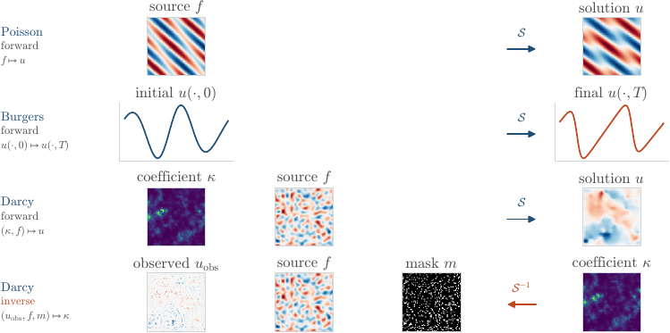

# FlowPDE

**Flow-based generative models for forward and inverse PDE problems.**

FlowPDE is a PyTorch library for learning conditional distributions between PDE
fields. It combines flow matching with neural ODEs to solve forward problems and inverse problems.

[Documentation](https://sarperyn.github.io/FlowPDE/) ·
[Quickstart](https://sarperyn.github.io/FlowPDE/getting_started/quickstart/) ·
Project report coming soon

## What is included

- Poisson, Burgers, and Darcy dataset generation through
  [Exponax](https://fkoehler.site/exponax/)
- Forward and inverse datasets, including noisy and partial observations
- Flow matching and maximum-likelihood objectives over the same `NeuralODEFlow`
- MLP, ConvNet, ResNet, and UNet backbone neural network models
- ODE sampling, EMA training, evaluation in physical units, and reflow



## Setup

With [uv](https://docs.astral.sh/uv/) (recommended):

```bash
git clone https://github.com/sarperyn/FlowPDE.git
cd FlowPDE
uv python install 3.11
uv sync
source .venv/bin/activate
```

Without `uv`, use Python's built-in virtual environment and pip:

```bash
git clone https://github.com/sarperyn/FlowPDE.git
cd FlowPDE
python3.11 -m venv .venv
source .venv/bin/activate
python -m pip install --upgrade pip
python -m pip install -r requirements.txt
python -m pip install -e . --no-deps
```

FlowPDE requires Python 3.11 or newer. The `uv` path uses the versions recorded in
`uv.lock`; the pip path installs the runtime dependencies from `requirements.txt`.
See the [installation guide](https://sarperyn.github.io/FlowPDE/getting_started/installation/)
for CUDA/JAX and optional dependencies.

## Quick Example

```python
import torch
from torch.utils.data import DataLoader

from flowpde import NeuralODEFlow, FlowMatchingObjective, Trainer, UNet
from flowpde.datasets import PoissonGenerator, FieldNormalizer

# Generate and normalize f -> u training pairs.
generator = PoissonGenerator(num_spatial_dims=2, num_points=64, domain_extent=10.0)
train_ds = generator.generate(num_samples=1000, seed=42, problem="forward")

normalizer = FieldNormalizer.from_dataset(train_ds)
train_ds.set_normalizer(normalizer)
loader = DataLoader(train_ds, batch_size=32, shuffle=True)

# The flow defines the dynamics; the objective defines how they are trained.
model = UNet(spatial_dim=2, spatial_size=64, base_channels=64)
flow = NeuralODEFlow(model, target_key="target", condition_key="input")
objective = FlowMatchingObjective(flow, path="linear", time_sampler="uniform")

optimizer = torch.optim.Adam(objective.parameters(), lr=1e-4)
trainer = Trainer(objective, optimizer, device="cpu", ema_decay=0.999)
trainer.train(loader, epochs=100, print_stats_interval=10,
              save_dir="results/poisson/", save_interval=25)

# Generate a solution conditioned on a PDE input.
batch = next(iter(loader))
samples = objective.sample(batch["input"], n_steps=50).view_as(batch["target"])
```

The [full quickstart](https://sarperyn.github.io/FlowPDE/getting_started/quickstart/)
adds validation, checkpointing, and evaluation in physical units.

## Representative Results

### Burgers

For the 1D Burgers forward problem, FlowPDE learns the map from an initial state
$u(x,0)$ to the evolved state $u(x,T)$. The ConvNet experiment reaches a test
relative $L^2$ error of **0.021**; the example below has an error of **0.018**.


### Poisson

For the 2D Poisson forward problem, the model maps a source field $f$ to its solution
$u$. In the harder eight-mode source regime, the ConvNet reaches a test relative
$L^2$ error of **0.078**. The example below shows the source, reference solution,
generated solution, and pointwise error.


These are single-seed results evaluated in physical units with 50 Euler steps. See
the [documentation](https://sarperyn.github.io/FlowPDE/) for the training and
evaluation workflow. The complete experimental setup and discussion will be included
in the forthcoming project report.

## Tests and Documentation

```bash
uv sync --extra dev --extra docs

uv run -m pytest                    # full suite
uv run -m pytest -m "not slow"      # skip the Exponax integration tests

uv run mkdocs serve                 # preview at http://127.0.0.1:8000
uv run mkdocs build --strict
```

## License

[MIT](LICENSE)
