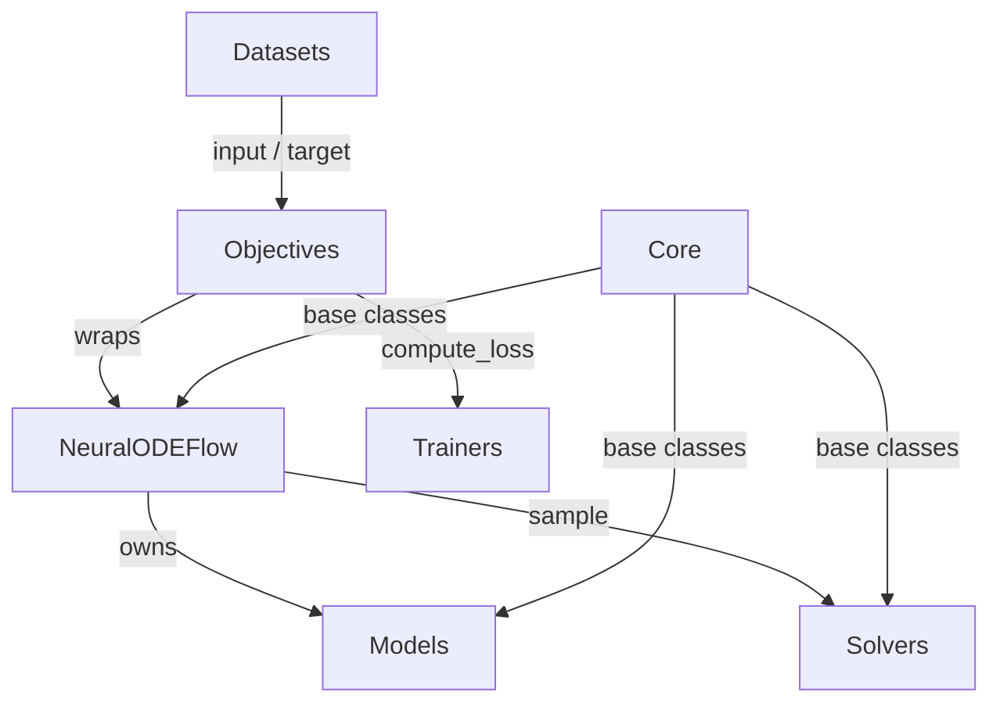
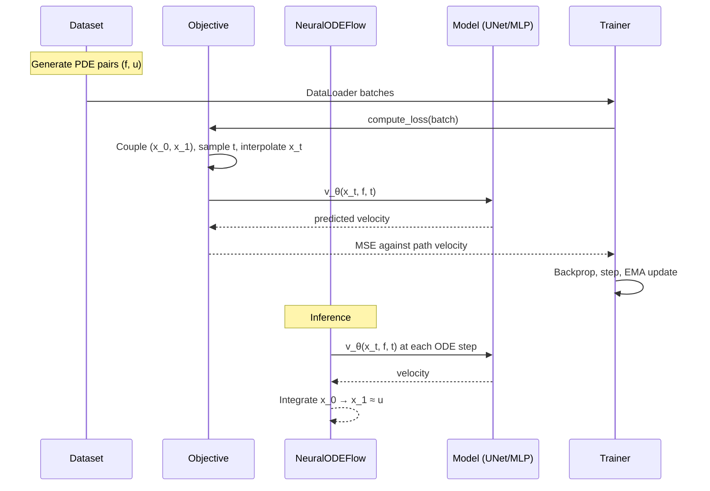

# Architecture Overview

## The central separation: flow vs. objective

This is the most important structural fact about FlowPDE.

- **`NeuralODEFlow`** is the continuous-time *dynamics*: it owns the model, sampling by
  ODE integration, and exact log-likelihood via the Jacobian trace.
- **Objectives** are *how you train that flow*. `FlowMatchingObjective` regresses
  velocities along interpolation paths; `MaximumLikelihoodObjective` maximizes exact
  log-likelihood.

Both objectives wrap the same flow. Training logic does not go on the flow, and
dynamics do not go in an objective.

## Module Overview

### Core (`flowpde.core`)

Abstract base classes and the configuration system.

- **`BaseFlow`** — `forward_transform()`, `inverse_transform()`, `sample()`, `log_prob()`
- **`BaseSolver`** — abstract ODE solver interface
- **`BaseConditioner`** — `ConcatConditioner`, `FiLMConditioner`, `NullConditioner`
- **`ExperimentConfig`** — typed dataclass hierarchy for recording runs

!!! note "Core never imports a config layer"
    `FlowMatchingObjective(...)` works with zero config machinery in the picture.
    Configuration is specified in Python and serialized *out* via `get_config()`.

### Flows (`flowpde.flows`)

`NeuralODEFlow` — the dynamics — plus the pluggable components that flow matching
composes:

| Component | Options |
|-----------|---------|
| **Path** | `LinearPath`, `OTConditionalPath` |
| **Time Sampler** | `UniformSampler`, `LogitNormalSampler`, `BetaSampler`, `TruncatedSampler` |
| **Coupling** | `IndependentCoupling`, `MiniBatchOTCoupling` |
| **Source** | `GaussianSource`, `BatchSource` |

Each getter accepts **either a registry name or an instance**, which is what makes the
API config-friendly without making config a dependency.

### Objectives (`flowpde.objectives`)

| Objective | Loss |
|-----------|------|
| **Flow Matching** | \(\mathcal{L} = \mathbb{E}\big[\|v_\theta(x_t, f, t) - v_t\|^2\big]\) |
| **Maximum Likelihood** | \(-\mathbb{E}\big[\log p(z) - \int \mathrm{tr}(\partial v/\partial x)\, dt\big]\) |

`create_flow_matching(flow, variant=...)` provides the presets `standard`,
`rectified`, `ot_cfm`, and `ot_cfm_coupled`.

### Models (`flowpde.models`)

Backbones for the velocity field \(v_\theta(x, f, t)\):

| Model | Best For | Key Features |
|-------|----------|--------------|
| **MLP** | Low-dimensional domains | Fourier time embedding, residual layers |
| **UNet** | Spatial grids (1D/2D) | Encoder–decoder with skips, bottleneck attention |
| **ConvNet** | Spatial grids | Residual CNN with time conditioning |
| **ResNet** | Spatial grids | Fully convolutional, configurable depth |

All share the interface `forward(x, f, t) → velocity`.

### Solvers (`flowpde.solvers`)

`ODEFlowSolver` wraps `torchdiffeq` with adaptive (`dopri5`, `dopri8`, `tsit5`,
`bosh3`) and fixed-step (`euler`, `midpoint`, `rk4`) methods, plus the adjoint method
for memory-efficient backpropagation.

### Trainers (`flowpde.trainers`)

- **`Trainer`** — takes any object exposing `compute_loss(batch)` and `.model`; gradient
  clipping, AMP, checkpointing, LR scheduling
- **`EMA`** — updated once per optimizer step with a warmup ramp; validation and
  checkpointing run under averaged weights
- **`FlowEvaluator`** — integrates the ODE, denormalizes, and scores against ground
  truth with a fixed evaluation seed; `ensemble_size > 1` is the UQ hook
- **`reflow`** — iterative path straightening

### Datasets (`flowpde.datasets`)

Spectral PDE data generation via [Exponax](https://fkoehler.site/exponax/):

- **`PoissonGenerator`** — source → solution (1D/2D/3D)
- **`BurgersGenerator`** — IC → final state (1D/2D)
- **`DarcyGenerator`** — \((\kappa, f) \rightarrow u\); `generate()` takes
  `inverse_mode` in `{'both', 'coefficient', 'source'}`
- **`FieldNormalizer`** — statistics keyed by raw field name, shared across train/val/test

## Tensor Shapes and Batch Keys

- Datasets emit `{'input': condition, 'target': solution}`. The flow maps these via
  `target_key` / `condition_key`, which default to `'u'` / `'f'` — **pass
  `target_key="target", condition_key="input"` with the Exponax datasets.**
- `BaseFlow._extract_target_condition` flattens everything to `(B, D)` before the model
  sees it. Convolutional backbones reshape internally using their `spatial_size` /
  `solution_channels` / `condition_channels`, and return flattened velocity when
  `return_spatial=False`.
- Condition and target need not share a dimension. When they differ, pass
  `target_shape=` to `sample()`.

## Data Flow

